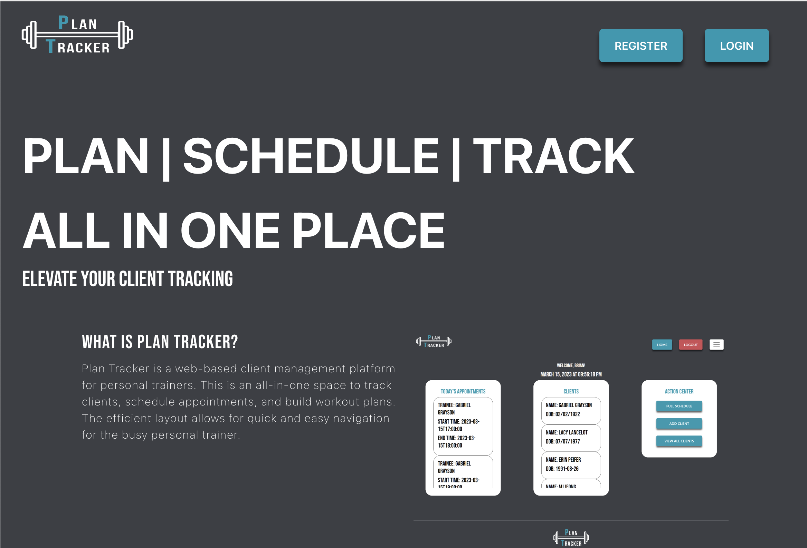
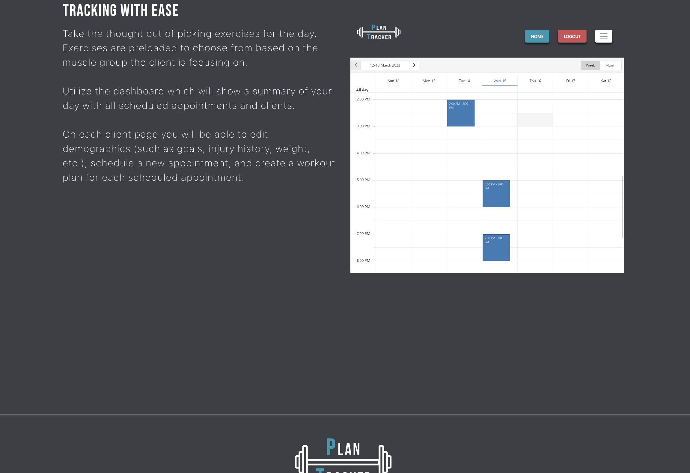
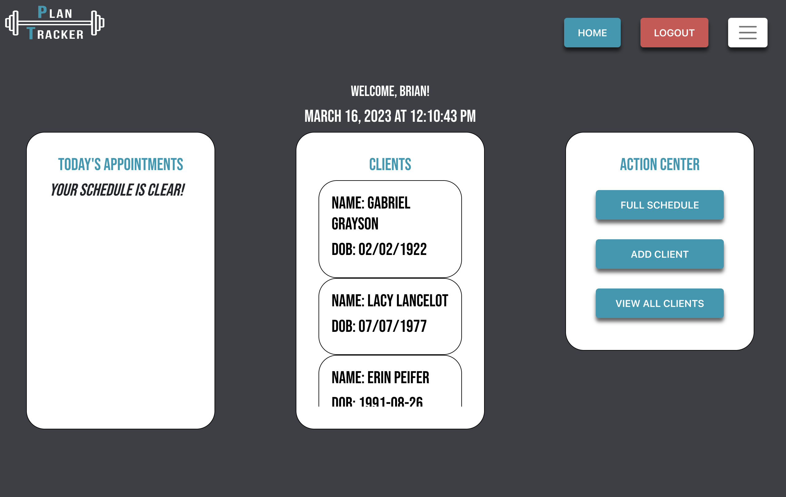
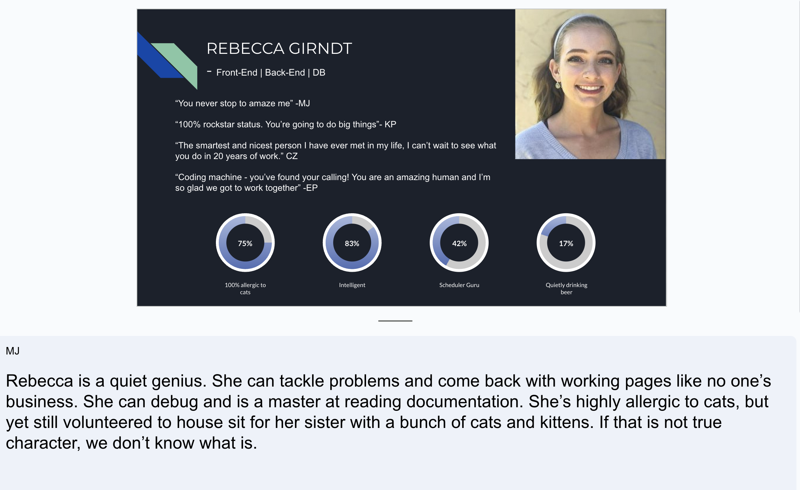
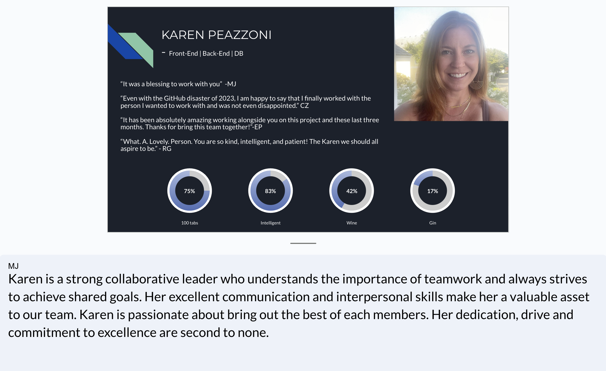
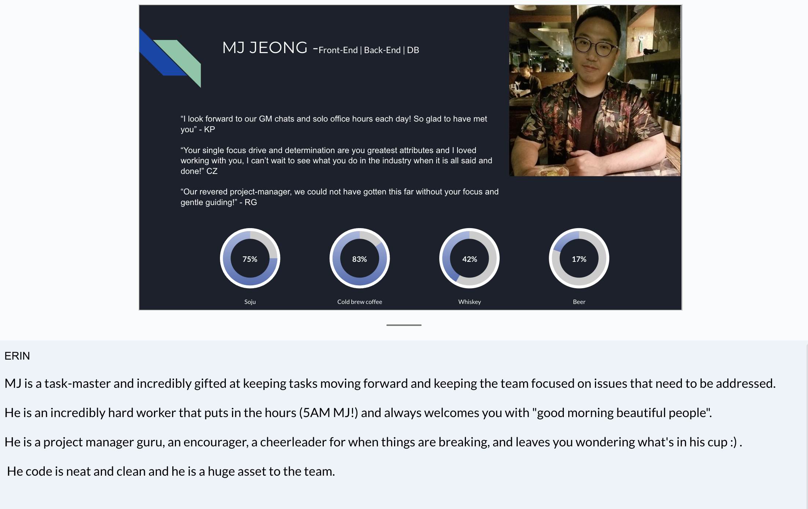
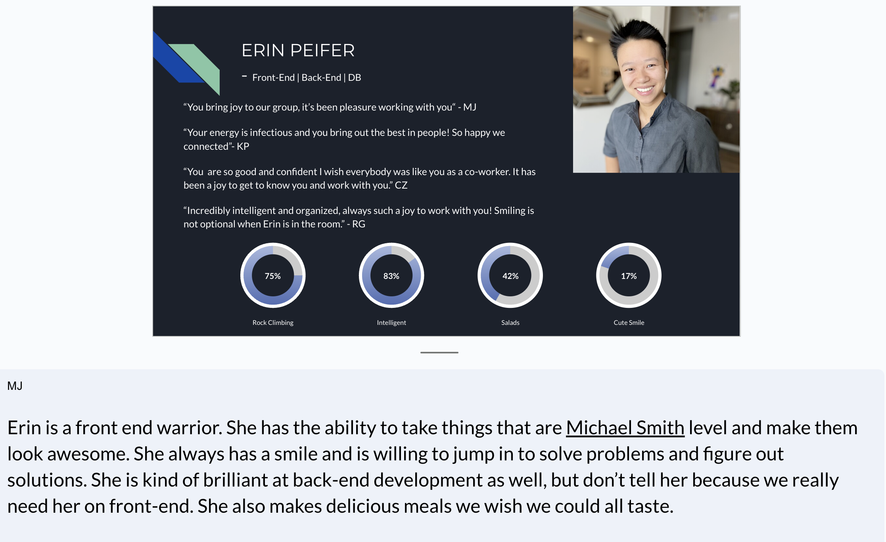
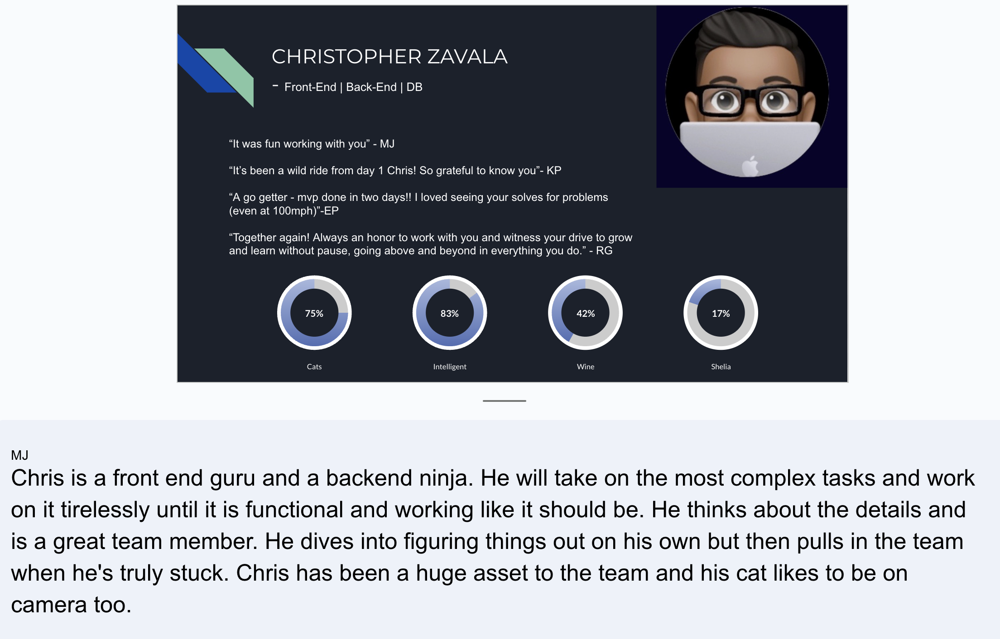

# PlanTracker

Version 1.0 \
Deployment Date: March 16, 2023  \
Contributors: Rebecca Girndt, Karen Peazonni, Jose Myeonghun Jeong, Erin Peifer, and Christopher Zavala

# Purpose

Plan Tracker is a web based application offering client management services to personal trainers  with features to plan their  schedules, store, track, manage client information. 

# Getting Started

Behind Our thought Process for our Final Project 3, Team Power-Haus,  brought our A game. We are showcasing the skills and talents to bring this app to life. We wanted to pick a project idea that we were passionate and in this process we made a full stack application that would solve a problem. Our group’s synergy was in creating an app that would take the organizational work flow to the next level for a trainer in maintaining his clientele. This is the simple overview of the application design, thought process and fruition brought together in one app called PlanTracker. 

Just use this link to get started! https://plan-tracker-app.herokuapp.com/

## Table of Contents  
  * [Built Using](#builtusing)
  * [Screenshots](#screenshots)
  * [Origianl Contributors](#origianlcontributors)
  * [Original Idea](#originalidea)
  * [Ideas for Future Development](#ideasforfuturedevelopment)
  * [Credits](#credits)
  * [License](#license)

## Built Using

## Screenshots

## Original Contributors
 \
Rebecca Girndt: <https://github.com/Re-Gi> \
Karen Peazzoni: https://github.com/kpeazzoni \
Myeonghun Jeong: https://github.com/mjtic \
Erin Peifer: https://github.com/Erinpeifer \
Christopher Zavala: <https://github.com/ChrisZavala> 

## Original Idea

\
The idea originally began with Erin Peifer, she is the master mind for this application. 
Web based application for personal trainers to track, plan, schedule, and update their trainees.

Erin Saw a need for personal trainer who was storing client data as individual notes in her phone. 

## Ideas for Future Development:
\
Have additional ideas for improving this site? Please first discuss the change you wish to make via email with the owners of this repository. Email addresses can be found on the contributor's gitHub pages (links above).

## Credits:
- Megan Meyers one of the UTA tutors for this bootcamp that has provided a wealth of knowledge about practically everything. Thank you so much for your support. 
Microsoft Visual Studio: <https://code.visualstudio.com/> \
GitHub: <https://github.com/>
Stack Overflow: <https://stackoverflow.com
Mozilla https://developer.mozilla.org/

## License

MIT License A short and simple permissive license with conditions only requiring preservation of copyright and license notices. Licensed works, modifications, and larger works may be distributed under different terms and without source code.

Copyright (c) 2012-2022 Scott Chacon and others

Permission is hereby granted, free of charge, to any person obtaining a copy of this software and associated documentation files (the "Software"), to deal in the Software without restriction, including without limitation the rights to use, copy, modify, merge, publish, distribute, sublicense, and/or sell copies of the Software, and to permit persons to whom the Software is furnished to do so, subject to the following conditions:

The above copyright notice and this permission notice shall be included in all copies or substantial portions of the Software.

THE SOFTWARE IS PROVIDED "AS IS", WITHOUT WARRANTY OF ANY KIND, EXPRESS OR IMPLIED, INCLUDING BUT NOT LIMITED TO THE WARRANTIES OF MERCHANTABILITY, FITNESS FOR A PARTICULAR PURPOSE AND NONINFRINGEMENT. IN NO EVENT SHALL THE AUTHORS OR COPYRIGHT HOLDERS BE LIABLE FOR ANY CLAIM, DAMAGES OR OTHER LIABILITY, WHETHER IN AN ACTION OF CONTRACT, TORT OR OTHERWISE, ARISING FROM, OUT OF OR IN CONNECTION WITH THE SOFTWARE OR THE USE OR OTHER DEALINGS IN THE SOFTWARE.